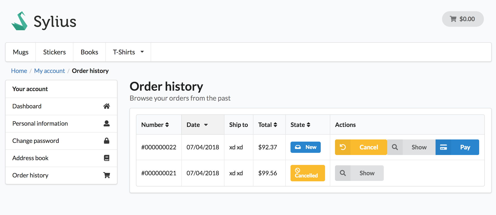

<p align="center">
    <a href="https://sylius.com" target="_blank">
        
    </a>
</p>

<h1 align="center">Customer Order Cancellation Plugin</h1>

<p align="center"><a href="https://sylius.com/plugins/" target="_blank"></a></p>

<p align="center">This plugin allows customers to cancel the placed order before it is processed.</p>



## Business Value

So far, once a Customer changed their mind about already placed Order, it was up to the Administrator to cancel the order.
However, we have asked ourselves a question - why can't Customer cancel the order when it is yet to be paid? Here comes
Customer Order Cancellation Plugin that allows canceling the unpaid order straight from the order history view.

## Installation

#### Beware!

> This installation instruction assumes that you're using Symfony Flex. If you don't, take a look at the
[legacy installation instruction](docs/legacy_installation.md). However, we strongly encourage you to use
Symfony Flex, it's much quicker! :)

To install plugin, just require it with composer:

```bash
composer require sylius/customer-order-cancellation-plugin
```

> Remember to allow community recipes with `composer config extra.symfony.allow-contrib true` or during plugin installation process

## Extension points

Customer Order Cancellation plugin uses `Order` entity derived from SyliusCoreBundle as well as its already defined states.

Default plugin implementation assumes that an Order can be canceled by a Customer when its payment state is 
`awaiting_payment` and shipment state equals `ready`. This conditions can be easily changed by creating a custom
implementation of `CustomerOrderCancellationCheckerInterface` or decorating the existing one.

## Security issues

If you think that you have found a security issue, please do not use the issue tracker and do not post it publicly. 
Instead, all security issues must be sent to `security@sylius.com`.
